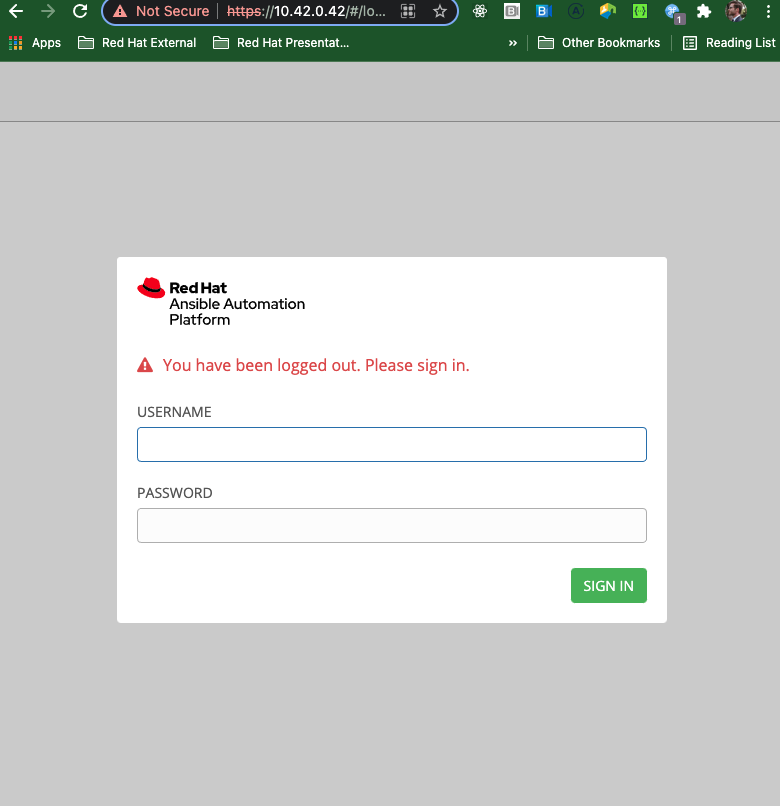
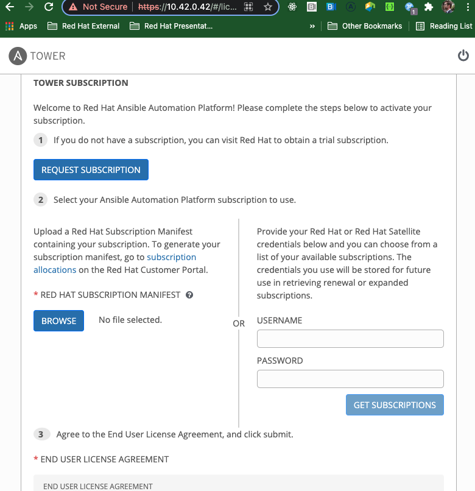
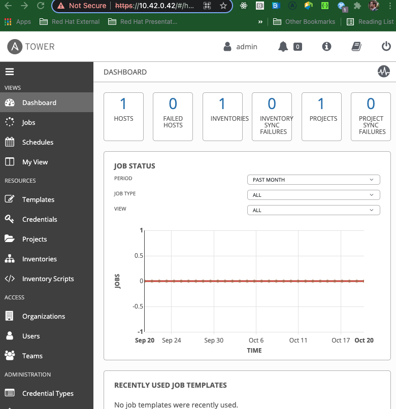

# Install Ansible Tower in Vagrant
- [Prerequisites](#prerequisites)
- [Spin up VM](#spin-up-vm)
- [SSH into VM](#ssh-into-vm)
- [Log into the UI](#log-into-the-ui)
- [Welcome to Tower](#welcome-to-tower)
- [Clean up](#clean-up)

## Prerequisites
In my environment I am using vagrant and virtualbox.

Install virtualbox
```
brew install --cask virtualbox
```

Install vagrant with brew
```
brew install vagrant
```

## Spin up VM
```
vagrant up --provider virtualbox
```

output
```
Bringing machine 'default' up with 'virtualbox' provider...
==> default: Importing base box 'ansible/tower'...
==> default: Matching MAC address for NAT networking...
==> default: Checking if box 'ansible/tower' version '3.8.4' is up to date...
==> default: Setting the name of the VM: automate-ansible-tower_default_1634846581307_67163
==> default: Clearing any previously set network interfaces...
==> default: Preparing network interfaces based on configuration...
    default: Adapter 1: nat
    default: Adapter 2: hostonly
==> default: Forwarding ports...
    default: 22 (guest) => 2222 (host) (adapter 1)
==> default: Running 'pre-boot' VM customizations...
==> default: Booting VM...
==> default: Waiting for machine to boot. This may take a few minutes...
    default: SSH address: 127.0.0.1:2222
    default: SSH username: vagrant
    default: SSH auth method: private key
    default: Warning: Connection reset. Retrying...
    default: Warning: Remote connection disconnect. Retrying...
    default: Warning: Connection reset. Retrying...
    default: Warning: Remote connection disconnect. Retrying...
    default: Warning: Connection reset. Retrying...
    default: Warning: Remote connection disconnect. Retrying...
    default: 
    default: Vagrant insecure key detected. Vagrant will automatically replace
    default: this with a newly generated keypair for better security.
    default: 
    default: Inserting generated public key within guest...
    default: Removing insecure key from the guest if it's present...
    default: Key inserted! Disconnecting and reconnecting using new SSH key...
==> default: Machine booted and ready!
==> default: Checking for guest additions in VM...
    default: The guest additions on this VM do not match the installed version of
    default: VirtualBox! In most cases this is fine, but in rare cases it can
    default: prevent things such as shared folders from working properly. If you see
    default: shared folder errors, please make sure the guest additions within the
    default: virtual machine match the version of VirtualBox you have installed on
    default: your host and reload your VM.
    default: 
    default: Guest Additions Version: 5.2.34
    default: VirtualBox Version: 6.1
==> default: Setting hostname...
==> default: Configuring and enabling network interfaces...
==> default: Mounting shared folders...
    default: /vagrant => /Users/cmwylie19/Public/automate-ansible-tower
```

## SSH into VM
```
vagrant ssh
```

output
```
Welcome to Ansible Tower!

  Log into the web interface here:

    https://10.42.0.42/

    Username: admin
    Password: Shd94WpS9s4c 

  The documentation for Ansible Tower is available here:

    http://www.ansible.com/tower/

  For help, visit  http://support.ansible.com/
```

## Log into the UI
Use the credentials output from the last command  
    
**Username**: admin   
**Password**: Shd94WpS9s4c 


## Upload Subscrition Manifest
Accept the user liscense, check the other check boxes about tracking.
   
Click browse, and import the Red Hat Subscription Manifest, and submit.


Docs on the subscription manifest can be found [here](https://docs.ansible.com/ansible-tower/latest/html/userguide/import_license.html?extIdCarryOver=true&intcmp=7013a000002prMPAAY&sc_cid=7013a000002w2ZaAAI#obtain-sub-manifest)

## Welcome to Tower
_This sums it up._


## Clean up
logout of the vagrant box in the cli:
```
$ logout
```
Destroy the vm
```
vagrant destroy
```

output
```
$ vagrant destroy
    default: Are you sure you want to destroy the 'default' VM? [y/N] y
==> default: Forcing shutdown of VM...
==> default: Destroying VM and associated drives...
```